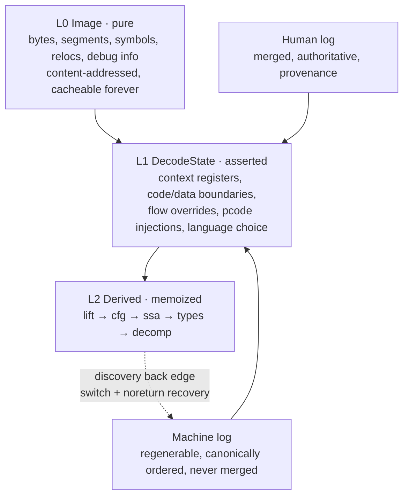

# ventris — architecture

Ventris is a dependency-free Rust binary-analysis library and native
decompiler. Ghidra is used only as an optional development oracle for
checked-in semantic fixtures; it is not a runtime, Cargo, CLI, or release
dependency.

Every quantitative claim below was measured against the workspace's own tests
or a named development-oracle fixture. Sources are named so they can be
re-run.

---

## 1. Thesis

One number frames the whole design. The same PS2 ELF (`slus21621.elf`,
10.7 MB), loaded two ways:

| load | outcome |
|---|---|
| auto-detected `MIPS:LE:64:64-32R6addr` | **12,158 functions**, all garbage |
| correct `r5900:LE:32:default` | **45 functions**, all real |

Same bytes. The difference is an *asserted* fact — which processor — that was
guessed by a loader. And the 45 real entries landed in an ELF overlay space, so
`list_functions` reported `image::0019d3f0`, which decompiles to
`halt_baddata()`, while the *same offset* in the default space decompiles to 16
valid instructions.

Three lessons, and they are the architecture:

1. **Addresses are not integers.** A bare offset meant two different things in
   one program.
2. **The important facts are asserted, not derived.** "Which processor", "this
   is code", "this register holds Thumb state" are decisions. Bytes alone
   decide nothing.
3. **Analysis must be re-runnable when an assertion changes.** Correcting the
   language invalidated 12,158 results.

Ghidra's shape fights all three: an application containing a library, backed by
a mutable single-writer database, analyzed in one batch pass. Symptoms measured
in one session: 35 s to analyze that ELF, a 4 GB heap, an exclusive project lock
that locked out a second (headless) reader, a 139-jar classpath, and no
`pip install ghidra`.

| Ghidra | ventris |
|---|---|
| Application containing a library | Library; CLI, server, GUI are all clients |
| Mutable transactional DB | Immutable image + two append-only logs |
| Batch "analyze everything" | Progressive discovery, then demand-driven queries |
| Exclusive project lock | Readers never block; writers append |
| JVM + 195 jars + classpath | One static binary + mmap'd language tables |

---

## 2. Layering

Every node is labelled at first mention, because a renderer that drops
late-bound labels turns the middle of a dependency graph into blank boxes.



**L1 is the crate that matters.** It is the intersection the earlier drafts left
blank: both logs write decode assertions into it, the generation barrier freezes
it, and everything in L2 is keyed on it. `ventris-log` defines its event shapes;
`ventris-gen` decides when it is stable enough to query.

Corollary the first draft got wrong: **"cacheable forever" applies to L0 only.**
Instructions are not L0. Evidence from Ghidra's own class names —
`InstructionDB` (instructions are database records),
`AbstractStoredProgramContext` (context registers are stored per-address),
`FlowOverride`, `ContextChange` — plus `DecompileCallback.getPcode`, which shows
the decompiler asks the *host* for p-code. ARM/Thumb settles it on its own: same
bytes, two decodings, selected by somebody's decision.

### Crate graph

Dependencies point from the native analysis layers toward the immutable image
and p-code foundations. The old Ghidra callback transport and oracle crates
were removed after the native decompiler became the product path.

| crate | depends on | role |
|---|---|---|
| `ventris-format` | addr | **L0**: ELF/PE/COFF, thin and universal Mach-O (explicit slice selection), text loaders, overlay derivation, machine facts |
| `ventris-log` | addr | three-tier identity, both logs, orphan policy, undo |
| `ventris-gen` | addr | discovery fixpoint, generations, oscillation detection |
| `ventris-db` | addr, log, gen | memo key, bounded cache, `Db` trait |
| `ventris-target` | format, lifter | console identity, loader, architecture, and baseline ABI defaults |
| `ventris-game` | target, lifter, pcode | game ABI profiles, nominal type facts, provenance, and conservative field recovery |
| `ventris-decompiler` | lifter, pcode | SSA, type propagation, CFG structuring, calls/globals, aggregate copies, and deterministic C rendering |

### Game-first product direction

The generic lifter and renderer are infrastructure. Ventris's primary output is
console-game source structure: readable C/C++, correct target ABI, preserved
nominal SDK/game types, and a path toward byte-matchable source.

`ventris-game` sits above lifted p-code and consumes facts from multiple sources:

* target-specific ABI profiles: register arguments/returns, stack frames, delay
  slots, caller/callee-save rules, small aggregate returns, and FPU/vector
  classes;
* repeated base-plus-offset accesses, array strides, pointer chains, global
  layouts, and later constructor/destructor/vtable patterns;
* symbols, relocations, external annotations, nominal type definitions, and user
  assertions.

Every recovered field has explicit confidence and provenance. An untyped
access is `unknown_bytes[N]`; it is never silently promoted to an integer,
pointer, struct, or engine type. The current vertical slice exposes this
contract through `recover-types`, with engine/runtime models and matching-C
emission as the next consumers rather than hidden guesses.

---

## 3. Addressing

Policy, stated once: a qualified address always wins; a bare offset resolves
only when exactly one *addressable* space maps it. Register, constant, and
SLEIGH `unique` spaces are never candidates for a bare offset.

That keeps the 95% single-space case ceremony-free without ever silently
choosing a space. Ambiguity is decided per *offset*, not per image, so a
multi-space program still resolves cleanly wherever only one space maps the
address.

---

## 4. Identity: three tiers, not one rule

"No minted IDs, ever" does not survive contact with named types. Structural
hashing collapses `POINT {int x; int y}` and `SIZE {int w; int h}` into one
type, and adding a field re-identifies a struct, silently detaching every
`Retype` that referenced it.

| tier | used for | derived from | collision |
|---|---|---|---|
| **Location** | functions, labels, comments, data | `(space, offset, kind)` | desirable — two branches annotating one address must converge |
| **Nominal** | named types | `(namespace, name)` | desirable — two branches declaring `POINT` must converge |
| **Structural** | anonymous machine-derived types | field `(offset, width)` list | desirable — dedup is the point |

Nominal identity is minting, honestly labelled: a *deterministic* mint that
lives in the mergeable log. Renaming a type does not change its identity;
adding a field does not either. That is what keeps annotations attached.

---

## 5. Two logs

One log cannot be both authoritative and regenerable.

- **Human log** — small, merged, authoritative, carries provenance.
- **Machine log** — analyzer output. Regenerable, never merged (each side
  rederives), sorted into a canonical `(address, kind, pass)` order before
  hashing or replay.

Canonical ordering is not cosmetic: analyzers run in parallel and append as they
finish, so without it the log's digest — and therefore the reproducibility key
and every differential test — varies run to run on identical input.

**Confidence is provenance.** No hand-maintained confidence field: an assertion's
weight is which log it came from, and human beats machine. This is the fix for
Ghidra's most rage-inducing behaviour — re-analysis clobbering your annotation —
and it falls out of the data model rather than being bolted on.

### Undo

Compensating events, never truncation. Once two logs have merged, "the last N
events" is not well defined per author, and truncation destroys the provenance
the log exists to provide. Event kinds without a defined inverse — a type
declaration, whose tombstone would orphan every `Retype` referencing it — report
`Unsupported` rather than silently doing the wrong thing.

### Orphan policy

A human assertion carries a coordinate *and* a fingerprint of what was there
when it was made. On rederivation:

| observed | outcome |
|---|---|
| coordinate and fingerprint match | `Exact` |
| exactly one candidate carries the fingerprint | `Reattached { from, to }` |
| something else is at the coordinate | `Orphan { FingerprintChanged }` |
| nothing is at the coordinate | `Orphan { CoordinateGone }` |
| several candidates carry the fingerprint | `Orphan { Ambiguous(n) }` |

There is no outcome that discards the assertion. "Human assertions always win"
is only meaningful if the thing they assert about still exists; orphans are
retained and surfaced, never dropped and never blindly applied.

---

## 6. Generations: the discovery fixpoint

Discovery is not a pass that runs before the lazy queries. Ghidra ships **152
analyzer classes**; among them `DecompilerFunctionAnalyzer`,
`DecompilerSwitchAnalyzer`, and `FindNoReturnFunctionsAnalyzer`. So discovery
*runs the decompiler*, and its results create new functions that invalidate the
decompilations that found them. There are also **five** distinct
`FunctionStart*` passes — a staged, whole-image prologue search.

Convergence conditions, because the mechanism is worthless without them:

- **Monotone in the function set.** Passes only add functions. One that removes
  a function is a bug, reported as `MonotonicityViolation`, not absorbed.
- **Non-monotone in the flow graph.** `noreturn` inference *retracts* callers'
  fall-through edges. Convergence therefore cannot be proven here; it is
  observed, bounded, and reported.
- **Oscillation is the real failure mode**, not divergence: an edge retracted by
  `noreturn` and re-added by flow discovery. Detected by state-hash repetition,
  frozen with the period and the participating pass names.
- **Bounded.** A pathological binary costs a known number of iterations, and
  hitting the cap is reported distinctly from oscillating.

A generation is a frozen, reproducible discovery state. An unsettled generation
is still *usable* — results derived from it are simply conditional, and
`Report::is_settled` says so.

**The honest headline** is therefore not "opening a binary is instant, you pay
only for what you look at." It is **progressive discovery with usable results at
generation 1, then demand-driven queries within a generation.** Function
boundary identification on stripped binaries is inherently global work; a large
share of Ghidra's 35 s is essential complexity, not waste. Rust and real
parallelism should beat it by a wide margin. That is a different claim, and a
defensible one.

---

## 7. The memo key

```
MemoKey = (image_hash, code_version, config_hash, human_log_hash)
```

`code_version` is present because two builds with different inference must not
serve each other's results. `human_log_hash` is present because human
`SetContext` / `DefineCode` assertions change how bytes decode — L1 is not
machine-only.

`decode_gen` is deliberately **absent from the key**. Given those four, the
machine log and therefore every generation is derivable, which makes a
generation a *verifiable* index into the key's history rather than an
independent axis of trust. Cache slots are still keyed by generation so results
from two discovery states cannot mix.

The cache takes a **byte budget and evicts**. Persistent memoization without
eviction is strictly worse than the 4 GB heap it replaces: it grows without
bound and never forgets. The cost of the budget is that "the second session
reuses the first session's work" degrades to "some of it" — which is why durable
memoization is a named risk, not a feature.
The native CLI exposes this as opt-in `--cache <dir>` persistence. Snapshots
are versioned and length-delimited; invalid or truncated snapshots fail closed,
and the current budget is re-applied when a snapshot is loaded.

---

## 8. Staging

**Stage 0 · parity by borrowing.** This was the initial transport design:
delegate decompilation to Ghidra's native binary and answer its callback
protocol. It is retained only in the project history and development notes;
the callback transport and model adapter are no longer built or shipped.

**Stage 1 · own the lifter.** Ventris now owns the checked architecture
decoders and p-code emission. Explicit processor selection remains mandatory;
the image parser never guesses a language from a container machine field.

*Done when:* the checked instruction corpus covers the advertised processor
paths with width, endian, delay-slot, and unsupported-opcode behavior pinned by
tests.

**Stage 2 · own the decompiler and game model.** SSA → ABI-aware,
constraint-based types → structuring → matching-C printer, scored against
checked semantic fixtures and console-game corpora. Types carry confidence and
provenance, so a user's assertion pins a node and the solver works around it
instead of overwriting it. `ventris-game` provides explicit console ABI
profiles plus conservative base-plus-offset and array-stride recovery.

*Done when:* native output preserves ABI-visible temporaries, calls and
globals, aggregate copies, declaration order, casts, and nominal field names
closely enough to support byte matching. The compiler-backed PS2 gate now
compiles reconstructed C and measures normalized assembly; the current
functions clear the regression threshold but are not exact matches.

**Stage 3 · Surfaces.** VS Code client and standalone GPUI desktop client share
the persisted project model. Ghidra remains an optional development oracle,
not a product or release surface.

### Current completion audit

The staged “Done when” clauses define the acceptance bar for each layer. The
current 0.1 surface is complete where the evidence below says so; the game
recovery row remains an explicitly bounded vertical slice rather than a claim
of full engine reconstruction:

| stage | status | evidence |
|---|---|---|
| Stage 0 · parity by borrowing | Retired | The callback transport and model adapter were removed after the native path became the product. External Ghidra comparison remains available only through checked-in fixtures and `tools/diff_ghidra.py`. |
| Stage 1 · own the lifter | Complete for the checked corpus | x86-64, x86-32, AArch64, ARM32/Thumb, MIPS32 little-/big-endian, PS1, N64, RV32/RV64, PPC32/PPC64, GameCube, M68k, SH2, SH4, 6502, Z80, and SPU are implemented; the checked-in lifter corpus covers native instruction forms for all twenty architecture paths, including endianness, PowerPC width, SPU control flow, and delay/return semantics. |
| Stage 2 · own the decompiler | Initial compiler-measured slice | SSA constraints, width/type propagation, store assignments, structured conditional returns and joins, calls, memory writes and reads, ABI return mapping, aggregate-copy rendering, and checked semantic body scores are covered by the native decompiler test gate. The public corpus spans x86-64, AArch64, MIPS, PowerPC, ARM, RISC-V, SH, 6502, and Z80 paths. The separate compiler gate compiles eight source-backed Dungeon Game functions for `mipsel-none-elf` and compares normalized mnemonic streams; it does not yet report exact matches. |
| Game ABI/type recovery | Initial vertical slice | `ventris-game` provides target-specific ABI facts, explicit unknown types, confidence/provenance, O32 direct/indirect call arguments and returns, deterministic non-overlapping base-plus-offset/`PTRADD` layouts, nominal fields and explicit object relations, symbols, relocations, and user assertions. Source-backed PS2 corpus expectations distinguish machine-derived exact evidence from successfully applied source metadata, and feed machine-readable exact/diverged/unsupported/unavailable reports through the opt-in corpus smoke runner. |
| Stage 3 · surfaces | Complete for the current 0.1 surfaces | The dependency-free VS Code client calls the local Ventris HTTP API; the separate GPUI desktop client reads persisted projects through the same public model; packaged VS Code command-path smoke covers startup, inspect, resolve, lift, native decompilation, game type recovery, recovered-source rendering, JSONL batch, HTTP errors, stale-server recovery, and result documents; the GPUI project fixture rendered the populated Functions/Data/References workspace; the Ghidra plugin release surface is intentionally absent. |


### Not in scope

No GUI is privileged in the core. The native GPUI workspace is a client and
uses persisted project facts rather than private analysis state; a documented
protocol still lets VS Code, an agent, or other frontends be the front end.
Ghidra remains an optional development oracle, not a product surface.

---

## 9. Risk register

Longer than the feature list, which is the point. The recurring failure of the
earlier drafts was presenting merge, undo, invalidation, and instant-open as
*free consequences* of a good data model; they were free only because they were
unspecified.

| # | risk | kill criterion |
|---|---|---|
| 1 | Program-model adapter is a **Stage 0** dependency, not Stage 2 | cannot encode types/symbols/namespaces on the stream → no Stage 0 at all |
| 2 | **Asset layer**: 21.7 MB of `.gdt` type archives + 204.1 MB of `.fidbf` signatures | measured deficit against the oracle on import-bearing PEs never closes |
| 3 | Discovery fixpoint runs through the decompiler | **oscillates** on real binaries (not "diverges" — oscillation is the observed mode) |
| 4 | Durable memoization | slips → cold-open survives, cross-session reuse silently does not |
| 5 | Log merge identity and undo inverses | an event kind has no deterministic identity, or no definable inverse |
| 6 | **Dangling human assertions** after rederivation | orphan rate on a real corpus high enough that users stop trusting their annotations |
| 7 | **Type identity** under structural collision | recursive/anonymous canonicalization proves unstable in practice |
| 8 | Loaders and the "binaries lie" long tail — Ghidra ships **92** loader classes and **15** `*Opinion` processor-guessing rules | fuzzing finds unbounded crash classes in format parsing |
| 9 | Constraint solver reaching oracle parity | Stage 2 stalls → ship Stage 1 forever (an acceptable outcome) |
| 10 | Unbounded memo cache | eviction thrash makes the cache useless at realistic budgets |

**Risk 8, first measurement.** `ventris-format` now covers ELF and PE with
bounds-checked parsing and four hostile-input sweeps: every prefix of a valid
file, every single-byte corruption at five values per offset, 2,000 pseudorandom
blobs half of which carry a real magic, and coarse truncation of the two real
corpus binaries. Zero panics. That closes the *shape* of the risk for two
formats, firmware blobs, memory dumps, console formats, and the remaining
container-specific long tail — open. It also produced two facts worth keeping:
only `PT_LOAD` has `p_flags == 0` (permissions are genuinely unknown, and
defaulting them to `rwx` would invent the "executable" fact disassembly depends
on), and the `image::` overlay is *derivable* — a non-ALLOC section named
`image` claiming the identical address range as that `PT_LOAD`.

Also live, not yet risks: user-defined `pcodeop`s carry no SLEIGH semantics, so
divergence from the oracle at those sites is *expected*; delay slots and
cross-instruction context are where MIPS/SPARC lifters quietly go wrong, which
is why Stage 1 gates on differential parity rather than inspection.

---

## 10. What the tests pin

The current workspace gate reports **168 passed tests across 23 suites** with
`cargo test --workspace --locked`. The L0 rows are cross-validated: the corpus
numbers were computed by an independent parser first (`ground_truth.json`), so
the Rust parser had something to be wrong against. The gate includes
architecture dispatch, native processor fixtures, native oracle parity
fixtures, custom handheld/console container fixtures, thin and universal
Mach-O slice handling, the real-PE opcode-gap fixture, and the native public
oracle-body score.

| invariant | test |
|---|---|
| PS2 ELF geometry matches an independent parser | `ps2_elf_geometry_matches_an_independent_parser` |
| the `image::` overlay is derived from the file | `ps2_elf_overlay_condition_is_derived_not_inherited` |
| that image makes a bare offset refuse | `ps2_elf_makes_a_bare_offset_refuse_with_both_candidates` |
| PE geometry matches an independent parser | `win_pe_geometry_matches_an_independent_parser` |
| a PE keeps bare offsets ergonomic | `pe_images_keep_bare_offsets_unambiguous` |
| L0 never decides the processor | `machine_facts_underdetermine_the_language` |
| every truncation survives | `no_prefix_of_a_valid_image_panics`, `truncated_real_images_do_not_panic` |
| every single-byte corruption survives | `no_single_byte_corruption_panics` |
| pseudorandom blobs survive | `no_pseudorandom_blob_panics` |
| corrupt name offsets stay bounded | `corrupt_section_name_offset_cannot_produce_a_huge_name` |
| absurd header counts stay bounded | `absurd_header_counts_are_bounded_by_the_input` |
| single space → bare offset works | `one_addressable_space_accepts_a_bare_offset` |
| the P3FES shape → refuse and name candidates | `two_spaces_mapping_one_offset_refuse_and_name_candidates` |
| ambiguity is per-offset, not per-image | `ambiguity_is_decided_by_mapping_not_space_count` |
| named types don't collapse by layout | `nominal_identity_separates_what_structural_identity_collapses` |
| adding a field keeps annotations attached | `adding_a_field_does_not_change_nominal_identity` |
| branches converge on one id | `nominal_ids_converge_across_branches` |
| moved entity reattaches | `moved_entity_reattaches_by_fingerprint` |
| changed entity orphans, not applied | `changed_entity_orphans_rather_than_applying_blindly` |
| several candidates orphan, not guessed | `several_candidates_orphan_rather_than_guess` |
| parallel append order is irrelevant | `machine_log_canonical_order_is_append_order_independent` |
| human beats machine | `human_assertions_beat_machine_assertions` |
| undo restores or tombstones | `undo_restores_prior_value_or_tombstones` |
| no-inverse events say so | `type_declarations_report_that_they_have_no_inverse` |
| edge retraction oscillation detected | `edge_retraction_oscillation_is_detected_not_looped` |
| function removal is a reported bug | `a_pass_that_removes_a_function_is_a_reported_bug` |
| runaway growth is bounded | `unbounded_growth_hits_the_cap_rather_than_hanging` |
| stale code version not served | `bumping_code_version_forces_recompute` |
| human log is in the key | `human_log_participates_in_the_key` |
| persistent memo snapshots round-trip | `cache_snapshot_round_trips_and_preserves_hits` |
| cache honours its budget | `cache_respects_its_byte_budget_under_pressure` |
| truncated memo snapshots fail closed | `truncated_cache_snapshot_is_rejected` |
| hostile reads don't panic | `out_of_range_reads_are_none_not_panics` |
| Stage 0 deficit is 12 of 16 | `coverage_counts_the_stage0_deficit` |
| explained divergences don't block | `explained_divergences_do_not_block_promotion` |
| explanations pinned per oracle version | `explanations_are_pinned_to_an_oracle_version` |
| explicit oracle path never overridden | `explicit_root_is_never_second_guessed` |
| host-executable decompiler chosen | `discovers_a_real_local_oracle` |
| native public corpus has exact semantic score | `public_native_corpus_matches_ghidra_oracles` |
| processor variants preserve width, endian, and CLI dispatch | `processor_variants_preserve_register_widths_and_endianness`, `decompile_native_supports_common_processor_raw_images` |
| new processors reject unsupported opcodes explicitly | `new_architectures_reject_unknown_opcodes` |
| custom handheld and console loaders expose bounded image facts | `handheld_and_console_containers_round_trip`, `self_and_xex_containers_expose_embedded_code`, `custom_loader_detection_and_language_facts_are_explicit` |
| real PE opcode gaps remain liftable | `real_binary_opcode_gap_fixture_lifts_all_instructions` |

---

## 11. Measured facts

| fact | value | source |
|---|---|---|
| Ghidra compiled classes | 58,515 in 195 jars (133 MB) | jar scan |
| Declared language variants | 174 across 39 processor modules | `.ldefs` scan |
| SLEIGH spec source | 303,403 lines (135 `.slaspec`, 193 `.sinc`) | line count |
| Compiled languages | 135 `.sla`, 12 MB | file scan |
| Native decompiler | 2.6 MB (win), 3.5 MB (linux) | file size |
| Decompiler host callbacks | **16 queries** | `javap ghidra.app.decompiler.DecompileCallback` |
| Analyzer classes | **152**, 33 discovery/flow-related | jar scan |
| Loader classes / Opinions | **92** / **15** | jar scan |
| Type archives / signature DBs | 21.7 MB `.gdt` / 204.1 MB `.fidbf` | file scan |
| Whole install | 907 MB | directory walk |
| Analysis of a 10.7 MB PS2 ELF | 35 s, 12,158 functions (wrong language) | headless run |
| Same ELF, correct language | 45 functions | headless run |
| Native lifter instruction corpus | 20/20 advertised architecture paths covered by one checked-in instruction fixture each | `every_advertised_architecture_has_one_instruction_fixture` + `checked_in_instruction_corpus_is_stable` |
| Workspace test gate | 168 passed across 23 suites | `cargo test --workspace --locked` |
| Rust build gate | Workspace builds in locked mode | `cargo build --workspace --locked` |
| Release binary build gate | Optimized `ventris-cli` binary builds in locked mode | `cargo build --release --locked -p ventris-cli` |
| Release metadata gate | `release-check: PASS (0.1.0)` | `python -S tools/release_check.py --version 0.1.0` |
| Native release smoke | `target/release/ventris.exe` passes `version`, `inspect`, `resolve`, `lift`, and semantic `decompile-native` comparison against the checked-in PE fixture | `tools/native_smoke.py` + `integrations/vscode/acceptance/semantic.json` |
| Clean-host native smoke | The release binary passes the same semantic command from an isolated temporary directory | `tools/clean_host_smoke.py` |
| HTTP boundary smoke | The release binary passes loopback health, 405/404/400 errors, oversized body/header rejection, and clean shutdown | `tools/http_smoke.py` |
| Python package tests | 28 passed | `PYTHONPATH=python python -S -m unittest discover -s python/tests` |
| Python install smoke | Fresh venv installed the wheel and `from ventris import version` returned `ventris 0.1.0` with `VENTRIS_BIN` set to the native executable | wheel + fresh virtual environment |
| Python source artifact | `ventris_client-0.1.0.tar.gz` contains the release policy files and only safe rooted regular-file entries; source verifier passes | `tools/verify_python_source.py` |
| VS Code host smoke | Start, inspect, native decompile, game type recovery, HTTP error, stale-server recovery, result documents | `npm run acceptance` |
| VS Code package | `ventris-binary-analysis-0.1.0.vsix`, ZIP integrity and license/security notices verified | `npm run package`, `tools/verify_vsix.py` |
| Native release archive | Deterministic ZIP built from `target/release/ventris.exe`; includes executable, license, notices, security policy, contributing guide, README, and changelog; archive verifier passes | `tools/package_release.py`, `tools/verify_release_archive.py` |
| Runtime dependency audit | Core Rust workspace has no external runtime crates; VS Code audit reports 0 vulnerabilities | `cargo tree --workspace --locked`, `npm audit --omit=dev --audit-level=high` |
| GPUI desktop workspace | Populated persisted-project workspace rendered in a manual desktop smoke; package tests pass (3 passed) | `cargo test --manifest-path desktop/ventris-gpui/Cargo.toml --locked` |
